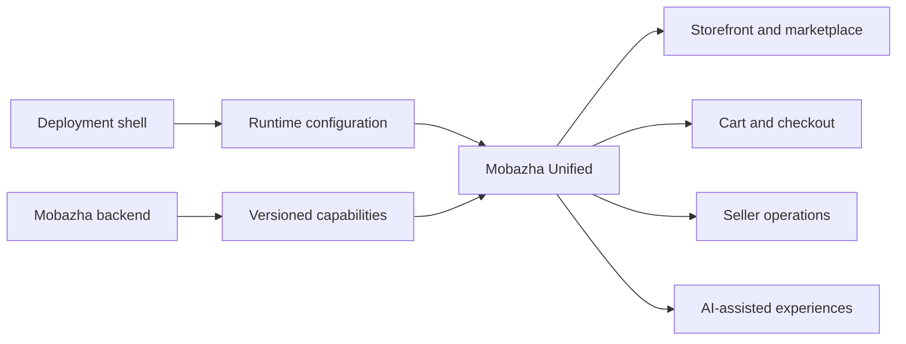

# Frontend Architecture Overview

Mobazha Unified has one shared frontend codebase for hosted services,
self-hosted nodes, dedicated marketplaces, and other compatible deployments.
Product behavior is composed at runtime rather than maintained in separate
frontend forks.

## Runtime authority

The shell selects deployment mode, experience, authentication transport, and
branding before React mounts. The backend remains authoritative for features
and commerce capabilities.

Components render a capability only after a valid backend snapshot is
available. Missing or malformed capability data fails closed; the frontend
does not infer support from source files, environment names, or a known payment
identifier.

## Application entry points

The Vite entry supports development and embedded application use. The Next.js
entry supports production SSR. Both use the same outer provider tree and must
preserve equivalent runtime-capability behavior.

## Package responsibilities

| Path | Responsibility |
| --- | --- |
| `apps/web` | Vite and Next.js web entry points |
| `apps/extension` | Browser extension entry point |
| `packages/core` | Runtime configuration, API, payment, and domain projections |
| `packages/commerce-web` | Shared commerce feature contracts |
| `packages/ui` | Reusable visual components |

For the complete runtime schema and invariants, read
[Runtime Product Composition](./RUNTIME_CAPABILITIES.md).
