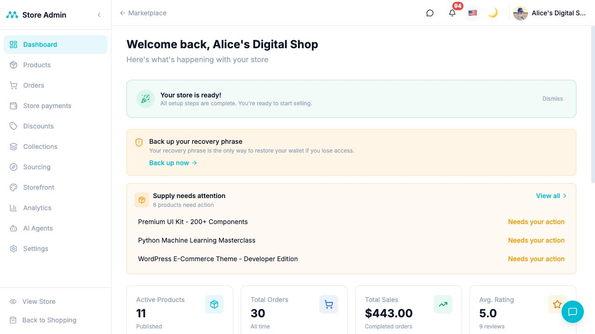

# Mobazha Product Tour

Mobazha Unified provides buyer and seller experiences for storefronts,
marketplaces, checkout, and store operations. The interface adapts to the
capabilities published by the connected Mobazha backend.

## Storefronts

The hosted application can serve branded stores, while the same frontend can
connect to a self-hosted Mobazha Node. Store availability, payment methods, and
optional services come from the connected backend rather than a frontend
edition switch.

## Seller operations

The seller interface brings together product management, orders, payments,
discounts, collections, sourcing, storefront design, analytics, and settings.
This screenshot comes from a seeded test environment and contains demonstration
data rather than production account activity.

## AI-assisted and agent-driven commerce

Deployments can expose AI-assisted seller workflows and connect external AI
clients through the Mobazha Node MCP endpoint. Agent tools remain
backend-authoritative, authenticated, scope-filtered, and capability-driven.
The exact UI and tool catalog depend on the connected deployment.

See [AI and agent integrations](https://github.com/mobazha/mobazha/blob/main/docs/concepts/AI_AND_AGENTS.md).

## Transaction demonstrations

- [Direct BCH payment demonstration](https://youtu.be/Q8bQWmm3Byw)
- [Moderated BCH purchase demonstration](https://youtu.be/nGiYy__ssXQ)

These recordings use an earlier interface and remain useful demonstrations of
the underlying commerce journeys. Current payment availability is always
determined by the connected backend.

## Try or develop

- [Open hosted Mobazha](https://app.mobazha.org/)
- [Run a self-hosted Mobazha Node](https://github.com/mobazha/mobazha/blob/main/docs/getting-started/SELF_HOSTING.md)
- [Connect this frontend to a local Node](../getting-started/CONNECT_TO_NODE.md)
